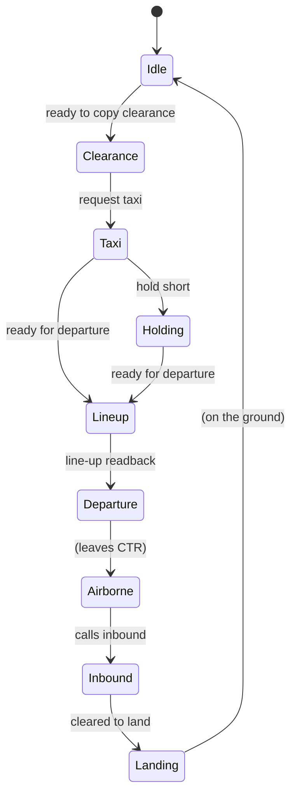

# ATC Simulator — Behaviour Reference

This document describes what the ATC trainer understands, how it replies, and
how it tracks each pilot. It is the contract between the pilot (you, on SRS) and
the bot. Keep it in sync with `atc/brain.py` and `atc/airspace.json`.

The bot is **rules-based and deterministic** — no LLM. Speech is transcribed by
Whisper, matched against regexes that tolerate common STT errors, and answered
with canned phraseology. Live aircraft positions come from the DCS state bridge
(`bridge/dcs_state_hook.lua`), which lets replies be distance- and
traffic-aware.

---

## 1. Radio / channel

| Item | Value |
| --- | --- |
| Tower frequency | 263.000 MHz AM (Kutaisi) — configurable with `--freq` |
| ATIS frequency | 270.500 MHz AM (Kutaisi) — configurable with `--atis-freq` |
| SRS | Bot joins as an External AWACS Mode client (password `atc`) |
| Coalition | Blue (2) |

Pilots call the tower; the tower answers. The bot only responds to transmissions
on its configured frequency. ATIS broadcasts on its own frequency (see §10).

**Agency naming (Master Arms convention):** an agency identifies itself by
**role** — *"Tower"*, *"Ground"*, *"Control"* — not the full name. The full name
(*"Kutaisi Control"*) is only used by the **pilot** when initiating contact, or
by AWACS when handing off. So the bot replies *"Colt 1, Tower, …"*, never
*"Colt 1, Kutaisi Tower, …"*. The short name is derived from the configured name
in `airspace.json` (last word).

---

## 2. Callsign recognition

The bot reads the **player-slot callsigns from the loaded mission** (`env.mission`
via the state bridge's `callsigns` op), so it only reacts to flights that actually
exist. In TTI Caucasus that is 14 flights: Anvil, Boar, Chevy, Colt, Dodge,
Enfield, Ford, Hawg, Heavy, Hornet, Pontiac, Springfield, Uzi, Viper.

STT mangles callsigns, so matching is tolerant:

- flight-name variants are **generated from phonetic confusion rules**
  (`atc/phonetics.py`), not hand-listed. Voiced/unvoiced pairs swap
  (`t`↔`d`, `p`↔`b`, `k`↔`g`), nasals blur (`m`↔`n`), vowels drift
  (`o`↔`u`, `a`↔`e`), and droppable letters (`l`, `r`, `t`, `d`, `h`) may vanish.
  So `Colt` yields `cold`, `bolt`, `coat`, `cult`, `kolt`, `cort`, … and
  `Ford` yields `fort`, `fold`, `vord`, … Variants that are themselves number
  words (e.g. `four` for `Ford`) are dropped to avoid false matches.
- flight numbers accept digits or spoken words, including homophones
  (`one`/`won`, `two`/`to`/`too`, `three`/`tree`, `four`/`for`, `eight`/`ate`)
- both `Colt 1` and `Colt 1-1` (flight + element) are recognised

Examples: `cold tree` → `Colt 3`, `kolt 2` → `Colt 2`, `fort 2` → `Ford 2`,
`hog 1` → `Hawg 1`, `vyper 1` → `Viper 1`, `springfeeld 2` → `Springfield 2`.

If no callsign is recognised, the bot stays silent (it assumes the transmission
was not for it). If a callsign is recognised but the request is not understood,
the tower replies **"say again"**.

> If the state bridge is unavailable, the bot falls back to a built-in list of
> common flight names. Tune the confusion rules in `atc/phonetics.py`
> (`CONFUSIONS`, `DROPPABLE`, `KNOWN_ERRORS`).

---

## 3. Phraseology the bot understands

| Pilot says (examples) | Intent | Tower replies |
| --- | --- | --- |
| "Ground, Colt 1" | **check-in** | "Colt 1, Ground." |
| "Ground, Colt 1, two-ship Hornets on Ramp South" | **check-in + position** | "Colt 1, Ground, runway 25 in use, QNH 2992." |
| "…with information Charlie" | **check-in + ATIS** | "Colt 1, Ground." (runway/QNH already read from ATIS) |
| "Ground, Colt 1, ready to copy clearance" | **clearance** | "Colt 1, Ground, after departure turn right Exit East, 1500 ft or below." |
| "After departure turn right Exit East, 1500 ft or below, Colt 1" | **readback** | "Colt 1, Ground, readback correct." |
| "Ground, Colt 1, requesting taxi" | **taxi** | "Colt 1, Ground, cleared taxi Sierra Echo and hold short runway 25." |
| "Cleared taxi Sierra Echo and hold short runway 25, Colt 1" | **readback** | "Colt 1, Ground, readback correct." |
| "Colt 1, holding short runway 25" | **hold short** (after taxi) | "Colt 1, Ground, contact Tower on channel 7." |
| "Tower, Colt 1, at runway 25, ready for departure" | **departure** (after taxi/holding) | "Colt 1, Tower, line up and wait runway 25." |
| "Line up and wait 25, Colt 1" | **readback** | "Colt 1, Tower, readback correct, wind calm, runway 25, right turnout, cleared for takeoff." |
| "Control, Colt 1, at 1500 ft" | **departure check-in** | "Colt 1, Control, radar contact, climb to Angels 15." |
| "Kutaisi Control, Colt 1, inbound 35 miles north at Angels 12" | **inbound** | "Colt 1, Control, radar contact, turn right heading 150 to join via Entry North." (heading is **computed** from the live position) |
| "150 to join via Entry North, Colt 1" | **readback** | "Colt 1, Control, descend to 1500 feet." |
| "Tower, Colt 1, Entry East" | **entry** | "Colt 1, Tower, report runway in sight." |
| "Tower, Colt 1, runway in sight" | **runway in sight** | "Colt 1, Tower, wind calm, cleared for left overhead break runway 25." |
| "Tower, Colt 1, on final" | **final** | "Colt 1, Tower, runway 25, wind calm, cleared to land." |
| "Tower, Colt 1, runway vacated" | **vacated** | "Colt 1, Tower, contact Ground on channel 6." |
| "Ground, Colt 1, rolling off runway 25, requesting taxi to parking" | **taxi to parking** | "Colt 1, Ground, cleared taxi to Ramp North via Alpha November." |
| "Colt 1, checking in" / "with you" | **check-in** | "Colt 1, Tower, roger." |
| "Colt 1, radio check" | **radio check** | "Colt 1, Tower, loud and clear." |
| "Colt 1, help" | **help** | a short, state-aware hint (see §3a) |

Intent matching is order-sensitive: the first matching rule wins. Some rules
require a prior state (e.g. "ready for departure" only clears line-up if the
aircraft has already been cleared to taxi).

**Readbacks (Master Arms).** The bot expects a readback of the departure
clearance, the taxi clearance, the line-up, and the Control join, and answers
**"readback correct"**. A readback is only recognised in the phase where one is
due, so a stray "roger" on Tower does not trigger it. The line-up readback is
special: it is what triggers the **takeoff clearance** (see §11).

---

## 3a. Help (trainer aid)

Because this is a *trainer*, a pilot who is unsure what to do can call
**"<callsign> help"** (also "assist", "what do I do", "what now", "remind me").
The bot replies with a short hint for the pilot's **current phase**, so it
always tells them the *next* call to make. It works on **every controller
frequency** (Ground, Tower, Control) and in **every phase** — you never have to
be on the "right" channel to ask for help.

Every hint is prefixed with a clear marker — **"Apollo suggests:"** — so it is
obvious the reply is training guidance, not a real clearance. (Apollo is the
Master Arms "Master of CTR" — a nod to the community whose SOP this trainer
follows.) The marker is the `help_prefix` variable in `phraseology.json`
(change it to taste, e.g. "Training hint").

| Pilot phase | Help reply (after the "Apollo suggests:" marker) |
| --- | --- |
| Idle (on the ground) | "contact Ground on channel 6 for clearance and taxi, then Tower on channel 7 for takeoff." |
| Cleared (clearance copied) | "read back your clearance, then request taxi." |
| Taxi | "taxi to runway 25 via Sierra Echo, then report holding short of runway 25." |
| Holding short | "you are holding short. Contact Tower on channel 7 and report ready for departure." |
| Line up | "line up and wait runway 25, then report ready for departure." |
| Departure | "you are cleared for takeoff runway 25. After departure turn right Exit East, 1500 ft or below, then contact Control on channel 8." |
| Airborne | "contact Control on channel 8 and report your position and intentions." |
| Inbound | "report entering the control zone, then report runway in sight." |
| Landing | "runway 25 is active. Report on final for landing clearance." |

The hint wording lives in `phraseology.json` (`help_*` templates); the
phase→template mapping is in `brain._help()`. Every hint ends with the escape
reminder *"Say reset to start over, or cancel to undo a clearance."* (see §3b).

---

## 3b. Escape hatches (never get stuck)

A rules-based state machine can trap a pilot: if a call is mis-heard, or the
pilot does the wrong thing, they can end up in a phase where the bot no longer
understands them. So there are three explicit ways out, valid on **every
controller frequency** (Ground, Tower, Control) and in **every phase**. Like
every other call, they are **addressed to a callsign** — the bot ignores a
transmission with no callsign, so always say who you are:

| Pilot says | Effect | Reply |
| --- | --- | --- |
| **"Colt 1, reset"** (also "restart", "start over", "new flight") | Full reset to the default `Idle` state — clears phase, gates, and flags | "Colt 1, Tower, state reset. Contact Ground on channel 6 when ready." |
| **"Colt 1, cancel"** (also "disregard", "scratch that"; "abort" accepted) | Cancels the current clearance and **steps back one phase** | "Colt 1, Tower, clearance cancelled." |
| **"Colt 1, say again"** (also "repeat") | Replays the **last clearance** the bot issued | the previous reply, verbatim |

`cancel` is the standard ATC word for withdrawing a clearance ("cancel"), so it
reads like real phraseology; `abort` is accepted as a pilot synonym. It steps
back along the flow, so it doubles as the natural "undo":

| Current phase | After `cancel` |
| --- | --- |
| Clearance / Taxi | Idle |
| Holding | Taxi |
| Line-up / Departure | Holding |
| Inbound | Airborne |
| Landing | Inbound (i.e. go around) |

`reset` is the blunt instrument (back to square one); `cancel` is the surgical
one (undo the last step). Both are **trainer aids** — a real controller would
not say "state reset", but in a trainer it is better to be unstuck than stuck.

> Design note: the escape words are matched **before** the controller handlers,
> so they work regardless of which frequency the pilot is on or what phase they
> are in. `say again` is also the natural response to a missed readback, so it
> replays the last clearance rather than the generic "say again" prompt.

---

## 4. Distance-aware inbound handling

When the pilot calls inbound, the reply depends on the aircraft's live position
relative to the CTR (from the state bridge):

| Position | Tower replies |
| --- | --- |
| **Outside** the CTR | "Colt 1, Tower, roger, report entering the control zone, runway 25 active." |
| **Inside** the CTR | "Colt 1, Tower, radar contact 4 miles north, cleared control zone entry, join left downwind runway 25." |
| Position unknown (no state bridge) | "Colt 1, Tower, runway 25, wind calm, cleared to land." |

The position phrase uses distance + 8-point compass from the airfield
(e.g. "4 miles north").

---

## 4a. Position cross-check (trainer: challenge bad reports)

A real controller does not blindly trust a position report — they cross-check it
against what they can see. The bot does the same using the live track: when a
pilot claims a position the radar does not support, the bot **challenges** it
and **does not advance the pilot's state** (so no clearance is issued on a false
report).

| Pilot claims | Bot checks (live track) | If it does not match |
| --- | --- | --- |
| "holding short runway 25" | at the threshold **or any named holding position** (P1–P4) | "…negative. I show you on the ground. Confirm your position." |
| "ready for departure" | at the threshold or any named holding position | "…negative. I show you 3 miles north. Confirm your position." |

The challenge uses the pilot's **actual** position (distance + compass, or "on
the ground" when very close), so the trainee learns to report correctly. The
wording is the `position_challenge` template in `phraseology.json`.

**Holding positions (P1–P4).** The MA aerodrome chart names four runway holding
positions, and the bot knows where they are (`airspace.json` → `holding_points`):

| Point | Name | Lat, lon |
| --- | --- | --- |
| P1 | Holding C | 42.17912, 42.48922 |
| P2 | Holding B | 42.17705, 42.47302 |
| P3 | Holding A/N | 42.17923, 42.46583 |
| P4 | Holding S/W | 42.17232, 42.46738 |

When a pilot reports holding short, the bot **names the holding position** it
shows them at: *"Colt 1, Ground, roger, holding at Holding C. Contact Tower on
channel 7."* A report is accepted if the aircraft is at the threshold **or** at
any holding point (`Airfield.is_holding_short`), so holding at B/A/N/S/W is not
wrongly challenged.

**Check areas on the map.** The map draws the areas the bot actually checks,
derived from the **same parameters** the brain uses (so the map cannot drift
from the logic):

- **Holding** (amber dashed circles): the threshold (0.6 NM) plus each named
  holding point (0.2 NM) — exactly where a "holding short" report is accepted.
- **Final approach** (blue dashed wedge): 12 NM from the threshold, ±40° of the
  runway centreline — exactly where `is_on_final` is true.
- **Runway corridor** (red dashed rectangle): the occupancy corridor
  (`runway_occupied`) — the full runway length plus a margin at both ends.

**Graceful without the bridge:** if there is no live state (no state bridge, or
the pilot is not found), the bot falls back to trusting the report — the trainer
still works offline.

---

## 4b. Bearing and distance (trainer aid)

To help find the CTR entry/exit points, a pilot can **request bearing and
distance**: *"<callsign> request bearing and distance [to Entry East]"*. This is
real phraseology (used especially in military/GCA control). The bot replies with
a **bearing and distance** from the pilot's live position to the named gate — or,
if no gate is named, to the **nearest** gate.

> "Colt 1, Control, bearing 014, distance 32 miles to Entry East."

DCS-style synonyms ("directions", "where is…") are also accepted, but the reply
uses the standard *"bearing X, distance Y"* format. Naming a CTR gate is an
**addition beyond the Master Arms SOP** (a training aid). Without a live position
the bot replies *"unable, no radar contact."* Wording lives in the
`directions_*` templates in `phraseology.json`.

---

## 4c. Vectors (approach vector, real phraseology)

*"<callsign> request vectors [for runway 25]"* gives a real **approach vector**:

> "Colt 1, Control, fly heading 018, vectors for runway 25."

The heading is the bearing from the pilot's live position to a point on the
**extended centreline** (10 NM before the threshold), so the pilot can intercept
the approach — the classic *"090 for 25"* call. The runway can be named in the
call; otherwise the active runway is used. Without a live position the bot
replies *"unable, no radar contact."* Template: `vectors` in `phraseology.json`.

> Note: this is distinct from §4b — **vectors** = headings to intercept the
> approach; **bearing and distance** = where a point is.

---

## 5. Per-pilot state machine

Each callsign has an independent state, so the bot handles multiple aircraft in
multiplayer. States and transitions:



| State | Meaning |
| --- | --- |
| `Idle` | On the ground, no clearance yet |
| `Clearance` | Departure clearance issued, awaiting readback |
| `Taxi` | Cleared to taxi to the runway |
| `Holding` | Holding short of the runway |
| `Lineup` | Cleared to line up and wait, awaiting readback |
| `Departure` | Cleared for takeoff |
| `Airborne` | Departed, outside the CTR |
| `Inbound` | Called inbound, cleared into the CTR |
| `Landing` | Cleared to land |

Each `PilotState` also tracks `cleared_inbound` (used to decide whether a CTR
entry is announced, see §6), `cleared_landing`, `descend_issued` (so Control
only issues the descent to 1500 ft once, see §11), and `go_around_issued` (so a
go-around is only called once per approach, see §7).

---

## 6. CTR boundary monitoring

A background thread polls live positions every 2 seconds and tracks each
aircraft's inside/outside state (`atc/ctr.py`). On a boundary crossing:

| Event | Condition | Tower action |
| --- | --- | --- |
| `ENTERED_CTR` | Aircraft enters the CTR **without** having called inbound | Broadcast: "Colt 1, Tower, you are entering controlled airspace without clearance. Squawk 4201 and state intentions." |
| `ENTERED_CTR` | Aircraft had called inbound | No action (already cleared) |
| `EXITED_CTR` | Aircraft leaves the CTR | No action (currently) |

The CTR is defined in `airspace.json` as a polygon (Kutaisi) or a radius around
the airfield, with a ceiling in feet AGL. Kutaisi: surface to 1500 ft AGL.

---

## 7. Runway occupancy and go-around

The bot detects when the runway is occupied — by another player, an AI aircraft,
or ground traffic — and warns an aircraft on final.

| Condition | Tower action |
| --- | --- |
| Aircraft on final, runway occupied | "Colt 1, Tower, go around, runway 25 is occupied." |
| Aircraft on final, runway clear | (no call; the landing clearance stands) |

Detection:
1. **Runway occupancy** (`Airfield.runway_occupied`): any unit within a corridor
   around the runway centreline (the full runway length plus a 0.25 NM margin at
   **both** ends, ±0.02 NM — the real runway half-width) and below 500 ft AGL.
   The aircraft being cleared is excluded so it does not count itself. The
   corridor is deliberately narrow: a wider one would swallow the parallel
   taxiway holding positions (P1/P2 are only ~50 m from the centreline) and
   wrongly block landing for a pilot holding short.
2. **Final approach** (`Airfield.is_on_final`): within 12 NM of the threshold,
   with both the bearing-to-threshold and the aircraft heading aligned with the
   runway within 40°.
3. The go-around fires **once per approach** (reset when the aircraft is no
   longer on final).

Runway heading is computed from the actual threshold-to-threshold bearing when
both runway ends are defined in `airspace.json` (accurate), falling back to the
runway number otherwise.

**Wind-based runway.** The active runway follows the wind (see §10): the bot
calls `Airfield.set_active_runway()` whenever the weather refreshes, so the
final-approach, occupancy and go-around checks use the **same** runway (07 or
25) as the clearances and the ATIS. Without this the checks would keep using the
configured runway even when the wind had shifted.

> Status: **implemented** (`brain.check_final`, `airspace.runway_occupied`,
> `airspace.is_on_final`).

### Traffic sequencing (players + AI)

The bot sequences clearances against **all live traffic** — players *and* AI
aircraft (`state.all_units()`), not just the pilot it is talking to:

| Pilot asks | Runway occupied? | Tower replies |
| --- | --- | --- |
| "ready for departure" | yes | "hold short, runway 25 is occupied." (stays `Holding`) |
| "ready for departure" | no | "line up and wait runway 25." |
| "on final" | yes | "continue approach, traffic on the runway." (stays `Inbound`) |
| "on final" | no | "cleared to land." |

So an AI aircraft on the runway blocks a line-up, and one on final ahead of you
is sequenced. The aircraft being cleared is excluded so it never blocks itself.
Without live traffic the bot trusts the pilot (offline behaviour unchanged).

---

## 8. What the bot does NOT do (yet)

- No squawk/transponder handling (the "squawk 4201" line is canned).
- No sequencing of multiple arrivals (first-come, first-served).
- No IFR clearances, holds, or instrument approaches.
- No taxi route from live airfield data (routes are configured per airfield, see §9).
- No parking-spot assignment (Ground clears to a named ramp, not a specific spot).

---

## 9. Configuration

`atc/airspace.json` holds per-airfield data:

```json
{
  "airfields": {
    "Kutaisi": {
      "tower": "Kutaisi Tower",
      "frequency_mhz": 263.0,
      "active_runway": "25",
      "ctr": { "ceiling_ft_agl": 1500, "polygon": [[lat, lon], ...] },
      "runways": { "25": { "threshold": [lat, lon] } },
      "gates": { "East": [lat, lon], ... },
      "taxi_routes": { "25": { "Ramp South": "Sierra Echo", "Ramp North": "November Delta" },
                       "07": { "Ramp South": "Whiskey", "Ramp North": "November Alpha" } },
      "parking_routes": { "Ramp South": "Whiskey", "Ramp North": "Alpha November" },
      "parking_areas": { "Ramp West": [lat, lon], "Ramp North": [lat, lon],
                         "Ramp East": [lat, lon], "Ramp South": [lat, lon] },
      "holding_points": { "Holding C": [lat, lon], "Holding B": [lat, lon],
                          "Holding A/N": [lat, lon], "Holding S/W": [lat, lon] }
    }
  }
}
```

Kutaisi CTR geometry is derived from the Master Arms community wiki
(https://wiki.masterarms.se/index.php/Airport_Procedures).

**Taxi routes:** DCS exposes parking positions but **no taxiway names**, so
routes are configured per airfield as `taxi_routes`: `{runway: {ramp: route}}`.
The bot picks the route for the **active runway** and the **ramp nearest the
aircraft**, so the clearance follows both the wind and where you are parked:

| From | → 25 | → 07 |
| --- | --- | --- |
| Ramp South | Sierra Echo | Whiskey |
| Ramp North | November Delta | November Alpha |
| Ramp West | November Delta | Alpha |
| Ramp East | Echo | Sierra |

Post-landing, `parking_routes` gives the route from the runway to the nearest
ramp (e.g. Ramp South → Whiskey). Route names come from the Master Arms
aerodrome chart (taxiways Alpha/Bravo/Charlie/Delta/Echo/November/Sierra/
Whiskey). The map shows each ramp's routes in its tooltip.

`atc/phraseology.json` holds the **reply wording** as templates with
`{placeholders}` (`{callsign}`, `{tower}`, `{runway}`, `{wind}`, `{position}`,
`{taxi_route}`, `{downwind}`, `{squawk}`). Edit the wording here to match a
community's SOP without touching Python. The *logic* — which call triggers which
template, and the state machine — stays in `brain.py`.

```json
{
  "variables": { "wind": "calm", "taxi_route": "alpha", "downwind": "left" },
  "templates": {
    "taxi": "{callsign}, {tower}, taxi to runway {runway} via {taxi_route}, hold short of runway {runway}.",
    "takeoff": "{callsign}, {tower}, wind {wind}, runway {runway}, cleared for takeoff."
  }
}
```

> Design note: only the *words* are configurable, not the intent matching. Regex
> logic in JSON would be unreadable and untestable; keeping it in Python keeps
> the behaviour debuggable.

---

## 10. ATIS

The bot broadcasts ATIS on a **separate frequency** (Kutaisi: 270.500 MHz AM,
from `airspace.json`'s `atis_frequency_mhz`). It repeats every
`--atis-interval` seconds (default 60; `0` disables).

The broadcast is built from **live DCS weather** (the bridge's `weather` op) and
the airfield config:

- **Information letter** — NATO phonetic, derived from the **mission time of day**
  (DCS runs on mission time, not the host clock): the bridge reports
  `mission_time_s` (seconds since midnight), so 14:00 mission time → `Oscar`.
  Falls back to the host clock only if the bridge does not report it.
- **Active runway** — chosen from the wind: the runway whose heading is most
  into wind (highest headwind component). Calm wind falls back to the configured
  active runway.
- **QNH** — DCS stores it in mmHg; converted to inches of mercury (760 → 29.92).
- **Weather** — CAVOK when visibility ≥ 10 km and cloud base ≥ 1500 m, else
  visibility and cloud base are read out.

Example broadcast:

> Kutaisi information Oscar. 25 in use. wind calm. QNH 29.92. CAVOK.
> Temperature 20. Advise on initial contact you have information Oscar.

Master Arms reference: ATIS is UHF channel 21 (270.x0, per-airfield); pilots
listen before contacting Ground and read back the active runway and QNH.

The **active runway and wind are shared with the tower**: the bot refreshes
weather every `--atis-interval` seconds and updates the brain, so taxi, takeoff
and landing clearances use the same runway the ATIS is advertising, and the
spoken wind matches the live weather (e.g. "wind 070 at 8").

## 11. Controllers (Ground / Tower / Control)

The bot answers on **three frequencies**, each mapped to a controller role. The
frequency a transmission arrives on selects the role, so the same callsign can
talk to Ground, then Tower, then Control without any manual switching.

| Controller | Frequency (Kutaisi) | Handles |
|------------|--------------------|---------|
| **Ground** | 250.000 MHz (`ground_frequency_mhz`) | Clearance delivery, taxi, hold-short |
| **Tower** | 263.000 MHz (`frequency_mhz`) | Line-up, takeoff, overhead break, landing |
| **Control** | 257.000 MHz (`control_frequency_mhz`) | CTR entry, inbound routing via entry point |

Frequencies and controller names come from `airspace.json`; CLI flags
`--ground-freq` / `--control-freq` override them (`0` disables a role).

### Ground

- "Ground, Colt 1" → check-in: *"Colt 1, Ground."*
- "…on Ramp South" (no ATIS info) → *"Colt 1, Ground, runway 25 in use,
  QNH 2992."* (with "information Charlie" → just *"Colt 1, Ground."*)
- "ready to copy clearance" → departure clearance with an **exit point**:
  *"after departure turn right Exit East, 1500 ft or below"*; the readback is
  confirmed with *"readback correct"*.
- "requesting taxi" → taxi clearance: *"cleared taxi Sierra Echo and hold short
  runway 25"*; the readback is confirmed with *"readback correct"*.
- "holding short runway 25" → handoff: *"contact Tower on channel 7"*.
- "requesting taxi to parking" (after landing) → *"cleared taxi to Ramp North
  via Alpha November"* (named ramp, or the nearest one to the aircraft).

### Tower

- "ready for departure" → **line up and wait**: *"line up and wait runway 25"*.
  The pilot's readback (*"line up and wait 25"*) triggers the takeoff clearance:
  *"readback correct, wind calm, runway 25, right turnout, cleared for takeoff"*.
- "runway in sight" / "overhead break" / "initial" → overhead-break clearance.
- "in the break" → acknowledged: *"roger, report on final"*.
- "Entry East" (arrival check-in at the entry point) → *"report runway in
  sight"*.
- "inbound" / "on final" → distance-aware inbound reply (see §4).
- "runway vacated" (after landing) → handoff: *"contact Ground on channel 6"*.

Pilots may address the field as **"Kutaisi Traffic"** (a common VFR call when
there is no live controller); the bot still recognises the callsign and answers
as Tower.

### Radio check

A pilot can test their setup with **"<callsign> radio check"** (also "how do
you read", "readability", "comm check"); the bot replies *"loud and clear"*.
This is real phraseology and works on any controller frequency.

### ATC online announcement

On startup the bot makes a **one-time** announcement on each controller
frequency — *"Tower ATC online."* — so a pilot tuning in knows the position is
manned. This is a **trainer convention**, not real phraseology (real controllers
never broadcast their arrival; pilots call them). Disable it with
`--no-announce`.

### Control

- "inbound" / "checking in" → radar contact and routing to join via the
  **entry point** nearest the aircraft: *"turn right heading 150 to join via
  Entry East"*. The heading is **computed** from the pilot's live position to
  the entry point (not a canned value); without a live position the heading is
  omitted (*"join via Entry East"*). The entry point is chosen from the
  aircraft's live position (`gate_locator`), falling back to a default. The
  pilot's readback triggers the descent: *"descend to 1500 feet"*.
- "passing the entry point" (already inbound) → handoff to Tower:
  *"contact Tower on channel 7"*.
- "airborne" / "climbing" / "at 1500 ft" (departure check-in) → *"radar
  contact, climb to Angels 15"*.
- "on final" / "runway in sight" / "overhead" → handoff to Tower:
  *"contact Tower on channel 7"*.

### Handoffs

The bot issues the standard Master Arms handoffs as the flight progresses:

- Ground → Tower: *"contact Tower on channel 7"* (`contact_tower`).
- Tower → Control (departures): *"contact Control on channel 8"*
  (`contact_control`).
- Tower → Ground (after landing): *"contact Ground on channel 6"*
  (`contact_ground`).

Entry/exit point names and the channel numbers live in `phraseology.json`
(`tower_channel`, `channel`) and `airspace.json` (`gates`).

### Worker threads

Each controller runs in its **own worker thread** with its own queue
(`atc/workers.py`). The SRS receive callback only enqueues a finished
transmission; the worker does the slow work (Whisper STT → brain → Piper TTS →
transmit). This means a slow transcription on Ground never blocks Tower.

All workers **share one `AtcBrain` and one `CtrTracker`**, guarded by a single
lock, so a pilot's state (phase, clearance, entry/exit gate) is consistent no
matter which controller they are talking to. Piper synthesis and the SRS
transmit queue are serialised with a separate lock.

### Voices

Each controller speaks with a **different Piper voice**, so Tower, Ground,
Control and ATIS sound like different people:

| Controller | Default voice | Flag |
|------------|---------------|------|
| Tower | `en_US-amy-medium` | `--voice` |
| Ground | `en_US-ryan-medium` | `--ground-voice` |
| Control | `en_US-lessac-medium` | `--control-voice` |
| ATIS | `en_GB-alan-medium` | `--atis-voice` |

Voices live in `atc/voices/` and are fetched with
`uv run python -m piper.download_voices --download-dir voices <name>`.

---

## 12. Complete flight walkthrough

A full example of a flight from cold start to shutdown, showing every pilot call
and the bot's reply. Frequencies (AM): **ATIS 270.500**, **Ground 250.000**,
**Tower 263.000**, **Control 257.000**. Callsign **Colt 1** (use your own).

### Departure

| # | Freq | Pilot says | Bot replies |
|---|------|-----------|-------------|
| 1 | ATIS | *(listen only)* | "Kutaisi information Oscar. 25 in use. wind calm. QNH 29.92. CAVOK. Temperature 20. Advise on initial contact you have information Oscar." |
| 2 | Ground | "Ground, Colt 1, two-ship Hornets on Ramp South with information Oscar." | "Colt 1, Ground." |
| 3 | Ground | "Ground, Colt 1, ready to copy clearance." | "Colt 1, Ground, after departure turn right Exit East, 1500 ft or below." |
| 4 | Ground | "After departure turn right Exit East, 1500 ft or below, Colt 1." | "Colt 1, Ground, readback correct." |
| 5 | Ground | "Ground, Colt 1, requesting taxi." | "Colt 1, Ground, cleared taxi Sierra Echo and hold short runway 25." |
| 6 | Ground | "Cleared taxi Sierra Echo and hold short runway 25, Colt 1." | "Colt 1, Ground, readback correct." |
| 7 | Ground | "Colt 1, holding short runway 25." | "Colt 1, Ground, contact Tower on channel 7." |
| 8 | Tower | "Tower, Colt 1, at runway 25, ready for departure." | "Colt 1, Tower, line up and wait runway 25." |
| 9 | Tower | "Line up and wait 25, Colt 1." | "Colt 1, Tower, readback correct, wind calm, runway 25, right turnout, cleared for takeoff." |
| 10 | Tower | "Tower, Colt 1, airborne." | "Colt 1, Tower, contact Control on channel 8." |
| 11 | Control | "Control, Colt 1, at 1500 ft." | "Colt 1, Control, radar contact, climb to Angels 15." |

You are now clear of the CTR — the departure is complete. (Steps 2–7 are the
Ground phase; 8–10 Tower; 11 Control.)

### Arrival

| # | Freq | Pilot says | Bot replies |
|---|------|-----------|-------------|
| 1 | Control | "Kutaisi Control, Colt 1, inbound 35 miles north at Angels 12." | "Colt 1, Control, radar contact, turn right heading 150 to join via Entry North." (heading computed) |
| 2 | Control | "150 to join via Entry North, Colt 1." | "Colt 1, Control, descend to 1500 feet." |
| 3 | Tower | "Tower, Colt 1, Entry North." | "Colt 1, Tower, report runway in sight." |
| 4 | Tower | "Tower, Colt 1, runway in sight." | "Colt 1, Tower, wind calm, cleared for left overhead break runway 25." |
| 5 | Tower | "Tower, Colt 1, on final." | "Colt 1, Tower, runway 25, wind calm, cleared to land." |
| 6 | Tower | "Tower, Colt 1, runway vacated." | "Colt 1, Tower, contact Ground on channel 6." |
| 7 | Ground | "Ground, Colt 1, rolling off runway 25, requesting taxi to parking." | "Colt 1, Ground, cleared taxi to Ramp North via Alpha November." |

You are now cleared to park — the flight is complete. (Steps 1–2 Control; 3–6
Tower; 7 Ground.)

### Trainer aids (any frequency)

| Pilot says | Bot replies |
|-----------|-------------|
| "Colt 1, help." | "Colt 1, Apollo suggests: …" (state-aware hint, see §3a) |
| "Colt 1, reset." | "Colt 1, Tower, state reset. Contact Ground on channel 6 when ready." (see §3b) |
| "Colt 1, cancel." | "Colt 1, Tower, clearance cancelled." (steps back one phase, see §3b) |
| "Colt 1, say again." | replays the last clearance (see §3b) |
| "Control, Colt 1, request bearing and distance to Entry East." | "Colt 1, Control, bearing 014, distance 32 miles to Entry East." |
| "Control, Colt 1, request vectors for runway 25." | "Colt 1, Control, fly heading 018, vectors for runway 25." |

### Position cross-checks (trainer: the bot checks you)

If a report does not match your live position, the bot **challenges** it and does
**not** advance your state (see §4a):

| Pilot says (but is elsewhere) | Bot replies |
|-----------|-------------|
| "Colt 1, holding short runway 25." *(still on the ramp)* | "Colt 1, Ground, negative. I show you on the ground. Confirm your position." |
| "Tower, Colt 1, ready for departure." *(still on the taxiway)* | "Colt 1, Tower, negative. I show you 2 miles south. Confirm your position." |
| "Tower, Colt 1, on final." *(not on final)* | "Colt 1, Tower, negative. I show you 3 miles north. Confirm your position." |

### Automatic calls (no pilot action)

- **ATIS** broadcasts every 60 s on 270.500 (§10).
- **CTR warning** if you enter controlled airspace without a clearance:
  "Colt 1, Tower, you are entering controlled airspace without clearance.
  Squawk 4201 and state intentions." (§6)
- **Go-around** if the runway is occupied while you are on final:
  "Colt 1, Tower, go around, runway 25 is occupied." (§7)

---

## 13. Live map view

The bot can serve a **live map** of the airfield it is managing, for an
overview of the traffic and each pilot's state. Start it with `--map-port`:

    uv run atc_bot.py --airfield Kutaisi --map-port 8080

Then open `http://<host>:8080/`. It can also run standalone (no bot, no SRS)
with `uv run map_server.py --airfield Kutaisi --port 8080`.

The page is **Leaflet + OpenStreetMap** (loaded from a CDN) and shows:

- **Airspace** from `airspace.json`: the CTR polygon (surface–ceiling), the
  entry/exit gates, runway thresholds, taxi routes and parking areas.
- **Aircraft**: every player aircraft, positioned live from the state bridge,
  labelled with **callsign · flight phase** and coloured by the **controller**
  they last talked to (Ground amber, Tower green, Control blue). A tooltip
  shows type, altitude and heading; a side table lists callsign, phase, altitude
  and heading.
- **AI air traffic**: AI planes/helicopters within 150 NM of the field, as small
  grey (blue) / red (red) triangles, so you can see the traffic the bot
  sequences against. The page draws only those in the **current viewport**, so
  zooming and panning declutter naturally.

Data comes from the same sources the bot uses — positions from the state bridge
(`state_client`), phases from the shared `AtcBrain` (`PilotState.phase`), and
geometry from `airspace.json` — so the map always agrees with what the
controllers are saying. The JSON endpoint is `/api/atc`; the page polls it every
2 seconds.

### Chatter log

The map has a collapsible **Chatter** drawer at the bottom showing recent radio
traffic: every pilot transmission (what Whisper heard), every ATC reply, and the
ATIS broadcast — each with time, frequency, agency and text. It is useful for
live debugging ("did the bot hear me? what did it reply?").

Each agency has a **checkbox filter** (Ground / Tower / Control / ATIS), so you
can hide the ATIS spam and watch just the controller you care about. The log
keeps the last 200 events.

> No extra Python dependencies: the server is stdlib `http.server`
> (`atc/map_server.py`), and the page is plain HTML/JS in `atc/web/`. If the
> state bridge is down the map still renders the airspace and shows a
> "DCS offline" note.

### Chart overlay (georeferenced kneeboard)

The map can overlay the **Master Arms aerodrome chart** (from their Kutaisi
kneeboard) at the correct scale and position, toggled with the **Chart**
checkbox. The chart is georeferenced from control points whose lat/lon are
printed on the chart itself (P1–P4, the holding positions) and whose pixel
positions are read off the image; an affine transform maps lat/lon → pixel.
Because the chart is rotated ~5° from north, it is **warped to a north-up
grid** first (Leaflet's `imageOverlay` is axis-aligned).

`atc/georef.py` does this and writes `atc/web/overlays/<airfield>.png` +
`.json` (lat/lon bounds). Regenerate with:

    uv run --with pillow georef.py --source <chart.png> --out web/overlays/kutaisi

The overlay is optional: if no `<airfield>.png`/`.json` exists, the map just
skips it. The same georeferencing was used to place the parking areas (see §9).
