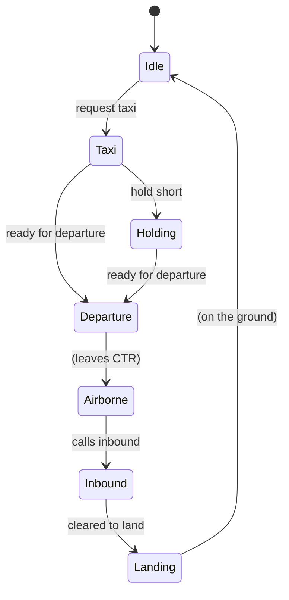

# ATC Simulator — Behaviour Reference

This document describes what the ATC trainer understands, how it replies, and
how it tracks each pilot. It is the contract between the pilot (you, on SRS) and
the bot. Keep it in sync with `atc/brain.py` and `atc/airspace.json`.

The bot is **rules-based and deterministic** — no LLM. Speech is transcribed by
Whisper, matched against regexes that tolerate common STT errors, and answered
with canned phraseology. Live aircraft positions come from the DCS state bridge
(`bridge/dcs_state_hook.lua`), which lets replies be distance- and
traffic-aware.

---

## 1. Radio / channel

| Item | Value |
| --- | --- |
| Tower frequency | 263.000 MHz AM (Kutaisi) — configurable with `--freq` |
| ATIS frequency | 270.500 MHz AM (Kutaisi) — configurable with `--atis-freq` |
| SRS | Bot joins as an External AWACS Mode client (password `atc`) |
| Coalition | Blue (2) |

Pilots call the tower; the tower answers. The bot only responds to transmissions
on its configured frequency. ATIS broadcasts on its own frequency (see §10).

**Agency naming (Master Arms convention):** an agency identifies itself by
**role** — *"Tower"*, *"Ground"*, *"Control"* — not the full name. The full name
(*"Kutaisi Control"*) is only used by the **pilot** when initiating contact, or
by AWACS when handing off. So the bot replies *"Colt 1, Tower, …"*, never
*"Colt 1, Kutaisi Tower, …"*. The short name is derived from the configured name
in `airspace.json` (last word).

---

## 2. Callsign recognition

The bot reads the **player-slot callsigns from the loaded mission** (`env.mission`
via the state bridge's `callsigns` op), so it only reacts to flights that actually
exist. In TTI Caucasus that is 14 flights: Anvil, Boar, Chevy, Colt, Dodge,
Enfield, Ford, Hawg, Heavy, Hornet, Pontiac, Springfield, Uzi, Viper.

STT mangles callsigns, so matching is tolerant:

- flight-name variants are **generated from phonetic confusion rules**
  (`atc/phonetics.py`), not hand-listed. Voiced/unvoiced pairs swap
  (`t`↔`d`, `p`↔`b`, `k`↔`g`), nasals blur (`m`↔`n`), vowels drift
  (`o`↔`u`, `a`↔`e`), and droppable letters (`l`, `r`, `t`, `d`, `h`) may vanish.
  So `Colt` yields `cold`, `bolt`, `coat`, `cult`, `kolt`, `cort`, … and
  `Ford` yields `fort`, `fold`, `vord`, … Variants that are themselves number
  words (e.g. `four` for `Ford`) are dropped to avoid false matches.
- flight numbers accept digits or spoken words, including homophones
  (`one`/`won`, `two`/`to`/`too`, `three`/`tree`, `four`/`for`, `eight`/`ate`)
- both `Colt 1` and `Colt 1-1` (flight + element) are recognised

Examples: `cold tree` → `Colt 3`, `kolt 2` → `Colt 2`, `fort 2` → `Ford 2`,
`hog 1` → `Hawg 1`, `vyper 1` → `Viper 1`, `springfeeld 2` → `Springfield 2`.

If no callsign is recognised, the bot stays silent (it assumes the transmission
was not for it). If a callsign is recognised but the request is not understood,
the tower replies **"say again"**.

> If the state bridge is unavailable, the bot falls back to a built-in list of
> common flight names. Tune the confusion rules in `atc/phonetics.py`
> (`CONFUSIONS`, `DROPPABLE`, `KNOWN_ERRORS`).

---

## 3. Phraseology the bot understands

| Pilot says (examples) | Intent | Tower replies |
| --- | --- | --- |
| "Kutaisi, Colt 1, requesting taxi to runway" | **taxi** | "Colt 1, Ground, taxi to runway 25 via alpha, hold short of runway 25." |
| "Colt 1, holding short" | **hold short** (after taxi) | "Colt 1, Ground, contact Tower on channel 7." |
| "Colt 1, ready for departure" | **departure** (after taxi/holding) | "Colt 1, Tower, wind calm, runway 25, cleared for takeoff." |
| "Kutaisi, Colt 1, inbound" | **inbound** | distance-aware, see §4 |
| "Colt 1, checking in" / "with you" | **check-in** | "Colt 1, Tower, roger." |
| "Colt 1, roger" / "wilco" / "copy" | **readback** | "Colt 1, Tower, roger." |
| "Colt 1, help" | **help** | a short, state-aware hint (see §3a) |

Intent matching is order-sensitive: the first matching rule wins. Some rules
require a prior state (e.g. "ready for departure" only clears takeoff if the
aircraft has already been cleared to taxi).

---

## 3a. Help (trainer aid)

Because this is a *trainer*, a pilot who is unsure what to do can call
**"<callsign> help"** (also "assist", "what do I do", "what now", "remind me").
The bot replies with a short hint for the pilot's **current phase**, so it
always tells them the *next* call to make. It works on any controller
frequency.

Every hint is prefixed with a clear marker — **"Apollo suggests:"** — so it is
obvious the reply is training guidance, not a real clearance. (Apollo is the
Master Arms "Master of CTR" — a nod to the community whose SOP this trainer
follows.) The marker is the `help_prefix` variable in `phraseology.json`
(change it to taste, e.g. "ATC suggests" or "Training hint").

| Pilot phase | Help reply (after the "ATC suggests:" marker) |
| --- | --- |
| Idle (on the ground) | "contact Ground on channel 6 for clearance and taxi, then Tower on channel 7 for takeoff." |
| Cleared (clearance copied) | "read back your clearance, then request taxi." |
| Taxi | "taxi to runway 25 via alpha, then report holding short of runway 25." |
| Holding short | "you are holding short. Contact Tower on channel 7 and report ready for departure." |
| Departure | "you are cleared for takeoff runway 25. After departure turn right Exit East, 1500 ft or below, then contact Control on channel 8." |
| Airborne | "contact Control on channel 8 and report your position and intentions." |
| Inbound | "report entering the control zone, then report runway in sight." |
| Landing | "runway 25 is active. Report on final for landing clearance." |

The hint wording lives in `phraseology.json` (`help_*` templates); the
phase→template mapping is in `brain._help()`.

---

## 4. Distance-aware inbound handling

When the pilot calls inbound, the reply depends on the aircraft's live position
relative to the CTR (from the state bridge):

| Position | Tower replies |
| --- | --- |
| **Outside** the CTR | "Colt 1, Tower, roger, report entering the control zone, runway 25 active." |
| **Inside** the CTR | "Colt 1, Tower, radar contact 4 miles north, cleared control zone entry, join left downwind runway 25." |
| Position unknown (no state bridge) | "Colt 1, Tower, runway 25, wind calm, cleared to land." |

The position phrase uses distance + 8-point compass from the airfield
(e.g. "4 miles north").

---

## 4a. Position cross-check (trainer: challenge bad reports)

A real controller does not blindly trust a position report — they cross-check it
against what they can see. The bot does the same using the live track: when a
pilot claims a position the radar does not support, the bot **challenges** it
and **does not advance the pilot's state** (so no clearance is issued on a false
report).

| Pilot claims | Bot checks (live track) | If it does not match |
| --- | --- | --- |
| "holding short runway 25" | within ~0.6 NM of the runway threshold | "…negative. I show you on the airfield. Confirm your position." |
| "ready for departure" | within ~0.6 NM of the runway threshold | "…negative. I show you 3 miles north. Confirm your position." |

The challenge uses the pilot's **actual** position (distance + compass, or "on
the airfield" when very close), so the trainee learns to report correctly. The
wording is the `position_challenge` template in `phraseology.json`.

**Graceful without the bridge:** if there is no live state (no state bridge, or
the pilot is not found), the bot falls back to trusting the report — the trainer
still works offline.

---

## 4b. Bearing and distance (trainer aid)

To help find the CTR entry/exit points, a pilot can **request bearing and
distance**: *"<callsign> request bearing and distance [to Entry East]"*. This is
real phraseology (used especially in military/GCA control). The bot replies with
a **bearing and distance** from the pilot's live position to the named gate — or,
if no gate is named, to the **nearest** gate.

> "Colt 1, Control, bearing 014, distance 32 miles to Entry East."

DCS-style synonyms ("directions", "where is…") are also accepted, but the reply
uses the standard *"bearing X, distance Y"* format. Naming a CTR gate is an
**addition beyond the Master Arms SOP** (a training aid). Without a live position
the bot replies *"unable, no radar contact."* Wording lives in the
`directions_*` templates in `phraseology.json`.

---

## 4c. Vectors (approach vector, real phraseology)

*"<callsign> request vectors [for runway 25]"* gives a real **approach vector**:

> "Colt 1, Control, fly heading 018, vectors for runway 25."

The heading is the bearing from the pilot's live position to a point on the
**extended centreline** (10 NM before the threshold), so the pilot can intercept
the approach — the classic *"090 for 25"* call. The runway can be named in the
call; otherwise the active runway is used. Without a live position the bot
replies *"unable, no radar contact."* Template: `vectors` in `phraseology.json`.

> Note: this is distinct from §4b — **vectors** = headings to intercept the
> approach; **bearing and distance** = where a point is.

---

## 5. Per-pilot state machine

Each callsign has an independent state, so the bot handles multiple aircraft in
multiplayer. States and transitions:



| State | Meaning |
| --- | --- |
| `Idle` | On the ground, no clearance yet |
| `Taxi` | Cleared to taxi to the runway |
| `Holding` | Holding short of the runway |
| `Departure` | Cleared for takeoff |
| `Airborne` | Departed, outside the CTR |
| `Inbound` | Called inbound, cleared into the CTR |
| `Landing` | Cleared to land |

Each `PilotState` also tracks `cleared_inbound` (used to decide whether a CTR
entry is announced, see §6), `cleared_landing`, and `go_around_issued` (so a
go-around is only called once per approach, see §7).

---

## 6. CTR boundary monitoring

A background thread polls live positions every 2 seconds and tracks each
aircraft's inside/outside state (`atc/ctr.py`). On a boundary crossing:

| Event | Condition | Tower action |
| --- | --- | --- |
| `ENTERED_CTR` | Aircraft enters the CTR **without** having called inbound | Broadcast: "Colt 1, Tower, you are entering controlled airspace without clearance. Squawk 4201 and state intentions." |
| `ENTERED_CTR` | Aircraft had called inbound | No action (already cleared) |
| `EXITED_CTR` | Aircraft leaves the CTR | No action (currently) |

The CTR is defined in `airspace.json` as a polygon (Kutaisi) or a radius around
the airfield, with a ceiling in feet AGL. Kutaisi: surface to 1500 ft AGL.

---

## 7. Runway occupancy and go-around

The bot detects when the runway is occupied — by another player, an AI aircraft,
or ground traffic — and warns an aircraft on final.

| Condition | Tower action |
| --- | --- |
| Aircraft on final, runway occupied | "Colt 1, Tower, go around, runway 25 is occupied." |
| Aircraft on final, runway clear | (no call; the landing clearance stands) |

Detection:
1. **Runway occupancy** (`Airfield.runway_occupied`): any unit within a corridor
   around the runway centreline (default 1.6 NM long, ±0.12 NM wide) and below
   500 ft AGL. The aircraft being cleared is excluded so it does not count
   itself.
2. **Final approach** (`Airfield.is_on_final`): within 8 NM of the threshold,
   with both the bearing-to-threshold and the aircraft heading aligned with the
   runway within 30°.
3. The go-around fires **once per approach** (reset when the aircraft is no
   longer on final).

Runway heading is computed from the actual threshold-to-threshold bearing when
both runway ends are defined in `airspace.json` (accurate), falling back to the
runway number otherwise.

> Status: **implemented** (`brain.check_final`, `airspace.runway_occupied`,
> `airspace.is_on_final`).

---

## 8. What the bot does NOT do (yet)

- No squawk/transponder handling (the "squawk 4201" line is canned).
- No sequencing of multiple arrivals (first-come, first-served).
- No IFR clearances, holds, or instrument approaches.
- No taxi route from live airfield data (routes are configured per airfield, see §9).
- No parking-spot assignment (Ground clears to a named ramp, not a specific spot).

---

## 9. Configuration

`atc/airspace.json` holds per-airfield data:

```json
{
  "airfields": {
    "Kutaisi": {
      "tower": "Kutaisi Tower",
      "frequency_mhz": 263.0,
      "active_runway": "25",
      "ctr": { "ceiling_ft_agl": 1500, "polygon": [[lat, lon], ...] },
      "runways": { "25": { "threshold": [lat, lon] } },
      "gates": { "East": [lat, lon], ... },
      "taxi_routes": { "alpha": [lat, lon], "bravo": [lat, lon] },
      "parking_areas": { "Ramp South": [lat, lon], "Ramp North": [lat, lon] }
    }
  }
}
```

Kutaisi CTR geometry is derived from the Master Arms community wiki
(https://wiki.masterarms.se/index.php/Airport_Procedures).

**Taxi routes:** DCS exposes parking positions but **no taxiway names**, so
routes are configured per airfield (`taxi_routes`: name → a representative
[lat, lon], e.g. a parking area). The bot picks the route **nearest the
aircraft's live position**, so a jet on the west apron gets "via alpha" and one
on the east apron gets "via bravo". Without a live position it falls back to the
first route. (The `parking` bridge op can dump an airbase's parking spots to help
pick representative points.)

`atc/phraseology.json` holds the **reply wording** as templates with
`{placeholders}` (`{callsign}`, `{tower}`, `{runway}`, `{wind}`, `{position}`,
`{taxi_route}`, `{downwind}`, `{squawk}`). Edit the wording here to match a
community's SOP without touching Python. The *logic* — which call triggers which
template, and the state machine — stays in `brain.py`.

```json
{
  "variables": { "wind": "calm", "taxi_route": "alpha", "downwind": "left" },
  "templates": {
    "taxi": "{callsign}, {tower}, taxi to runway {runway} via {taxi_route}, hold short of runway {runway}.",
    "takeoff": "{callsign}, {tower}, wind {wind}, runway {runway}, cleared for takeoff."
  }
}
```

> Design note: only the *words* are configurable, not the intent matching. Regex
> logic in JSON would be unreadable and untestable; keeping it in Python keeps
> the behaviour debuggable.

---

## 10. ATIS

The bot broadcasts ATIS on a **separate frequency** (Kutaisi: 270.500 MHz AM,
from `airspace.json`'s `atis_frequency_mhz`). It repeats every
`--atis-interval` seconds (default 60; `0` disables).

The broadcast is built from **live DCS weather** (the bridge's `weather` op) and
the airfield config:

- **Information letter** — NATO phonetic, derived from the **mission time of day**
  (DCS runs on mission time, not the host clock): the bridge reports
  `mission_time_s` (seconds since midnight), so 14:00 mission time → `Oscar`.
  Falls back to the host clock only if the bridge does not report it.
- **Active runway** — chosen from the wind: the runway whose heading is most
  into wind (highest headwind component). Calm wind falls back to the configured
  active runway.
- **QNH** — DCS stores it in mmHg; converted to inches of mercury (760 → 29.92).
- **Weather** — CAVOK when visibility ≥ 10 km and cloud base ≥ 1500 m, else
  visibility and cloud base are read out.

Example broadcast:

> Kutaisi information Oscar. 25 in use. wind calm. QNH 29.92. CAVOK.
> Temperature 20. Advise on initial contact you have information Oscar.

Master Arms reference: ATIS is UHF channel 21 (270.x0, per-airfield); pilots
listen before contacting Ground and read back the active runway and QNH.

The **active runway and wind are shared with the tower**: the bot refreshes
weather every `--atis-interval` seconds and updates the brain, so taxi, takeoff
and landing clearances use the same runway the ATIS is advertising, and the
spoken wind matches the live weather (e.g. "wind 070 at 8").

## 11. Controllers (Ground / Tower / Control)

The bot answers on **three frequencies**, each mapped to a controller role. The
frequency a transmission arrives on selects the role, so the same callsign can
talk to Ground, then Tower, then Control without any manual switching.

| Controller | Frequency (Kutaisi) | Handles |
|------------|--------------------|---------|
| **Ground** | 250.000 MHz (`ground_frequency_mhz`) | Clearance delivery, taxi, hold-short |
| **Tower** | 263.000 MHz (`frequency_mhz`) | Line-up, takeoff, overhead break, landing |
| **Control** | 257.000 MHz (`control_frequency_mhz`) | CTR entry, inbound routing via entry point |

Frequencies and controller names come from `airspace.json`; CLI flags
`--ground-freq` / `--control-freq` override them (`0` disables a role).

### Ground

- "ready to copy clearance" → departure clearance with an **exit point**:
  *"after departure turn right East, 1500 ft or below"*.
- "requesting taxi" → taxi clearance to the active runway.
- "holding short runway 25" → handoff: *"contact Tower on channel 7"*.- "requesting taxi to parking" (after landing) → *"cleared taxi to Ramp North
  via bravo"* (named ramp, or the nearest one to the aircraft).
### Tower

- "ready for departure" → takeoff clearance (wind + runway).
- "runway in sight" → overhead-break clearance.
- "inbound" / "on final" → distance-aware inbound reply (see §4).
- "runway vacated" (after landing) → handoff: *"contact Ground on channel 6"*.

### Control

- "inbound" / "checking in" → radar contact and routing to join via the
  **entry point** nearest the aircraft: *"turn right heading 150 to join via
  Entry East"*. The entry point is chosen from the aircraft's live position
  (`gate_locator`), falling back to a default.

### Handoffs

The bot issues the standard Master Arms handoffs as the flight progresses:

- Ground → Tower: *"contact Tower on channel 7"* (`contact_tower`).
- Tower → Control (departures): *"contact Control on channel 8"*
  (`contact_control`).
- Tower → Ground (after landing): *"contact Ground on channel 6"*
  (`contact_ground`).

Entry/exit point names and the channel numbers live in `phraseology.json`
(`tower_channel`, `channel`) and `airspace.json` (`gates`).

### Worker threads

Each controller runs in its **own worker thread** with its own queue
(`atc/workers.py`). The SRS receive callback only enqueues a finished
transmission; the worker does the slow work (Whisper STT → brain → Piper TTS →
transmit). This means a slow transcription on Ground never blocks Tower.

All workers **share one `AtcBrain` and one `CtrTracker`**, guarded by a single
lock, so a pilot's state (phase, clearance, entry/exit gate) is consistent no
matter which controller they are talking to. Piper synthesis and the SRS
transmit queue are serialised with a separate lock.

### Voices

Each controller speaks with a **different Piper voice**, so Tower, Ground,
Control and ATIS sound like different people:

| Controller | Default voice | Flag |
|------------|---------------|------|
| Tower | `en_US-amy-medium` | `--voice` |
| Ground | `en_US-ryan-medium` | `--ground-voice` |
| Control | `en_US-lessac-medium` | `--control-voice` |
| ATIS | `en_GB-alan-medium` | `--atis-voice` |

Voices live in `atc/voices/` and are fetched with
`uv run python -m piper.download_voices --download-dir voices <name>`.

---

## 12. Complete flight walkthrough

A full example of a flight from cold start to shutdown, showing every pilot call
and the bot's reply. Frequencies (AM): **ATIS 270.500**, **Ground 250.000**,
**Tower 263.000**, **Control 257.000**. Callsign **Colt 1** (use your own).

### Departure

| # | Freq | Pilot says | Bot replies |
|---|------|-----------|-------------|
| 1 | ATIS | *(listen only)* | "Kutaisi information Oscar. 25 in use. wind calm. QNH 29.92. CAVOK. Temperature 20. Advise on initial contact you have information Oscar." |
| 2 | Ground | "Ground, Colt 1, ready to copy clearance." | "Colt 1, Ground, after departure turn right Exit East, 1500 ft or below." |
| 3 | Ground | "Ground, Colt 1, requesting taxi." | "Colt 1, Ground, taxi to runway 25 via alpha, hold short of runway 25." |
| 4 | Ground | "Colt 1, holding short runway 25." | "Colt 1, Ground, contact Tower on channel 7." |
| 5 | Tower | "Tower, Colt 1, ready for departure." | "Colt 1, Tower, wind calm, runway 25, cleared for takeoff." |
| 6 | Tower | "Tower, Colt 1, airborne." | "Colt 1, Tower, contact Control on channel 8." |
| 7 | Control | "Control, Colt 1, airborne, 5 miles east climbing." | "Colt 1, Control, radar contact." |

You are now clear of the CTR — the departure is complete. (Steps 2–4 are the
Ground phase; 5–6 Tower; 7 Control.)

### Arrival

| # | Freq | Pilot says | Bot replies |
|---|------|-----------|-------------|
| 1 | Control | "Control, Colt 1, inbound 35 miles north." | "Colt 1, Control, radar contact, turn right heading 150 to join via Entry North." |
| 2 | Tower | "Tower, Colt 1, inbound." | "Colt 1, Tower, report entering the control zone, runway 25 active." *(outside CTR)* — or "radar contact 4 miles north, cleared control zone entry, join left downwind runway 25." *(inside CTR)* |
| 3 | Tower | "Tower, Colt 1, runway in sight." | "Colt 1, Tower, wind calm, cleared for left overhead break runway 25." |
| 4 | Tower | "Tower, Colt 1, on final." | "Colt 1, Tower, runway 25, wind calm, cleared to land." |
| 5 | Tower | "Tower, Colt 1, runway vacated." | "Colt 1, Tower, contact Ground on channel 6." |
| 6 | Ground | "Ground, Colt 1, requesting taxi to parking." | "Colt 1, Ground, cleared taxi to Ramp North via bravo." |

You are now cleared to park — the flight is complete. (Steps 1 Control; 2–5
Tower; 6 Ground.)

### Trainer aids (any frequency)

| Pilot says | Bot replies |
|-----------|-------------|
| "Colt 1, help." | "Colt 1, Apollo suggests: …" (state-aware hint, see §3a) |
| "Control, Colt 1, request bearing and distance to Entry East." | "Colt 1, Control, bearing 014, distance 32 miles to Entry East." |
| "Control, Colt 1, request vectors for runway 25." | "Colt 1, Control, fly heading 018, vectors for runway 25." |

### Position cross-checks (trainer: the bot checks you)

If a report does not match your live position, the bot **challenges** it and does
**not** advance your state (see §4a):

| Pilot says (but is elsewhere) | Bot replies |
|-----------|-------------|
| "Colt 1, holding short runway 25." *(still on the ramp)* | "Colt 1, Ground, negative. I show you on the airfield. Confirm your position." |
| "Tower, Colt 1, ready for departure." *(still on the taxiway)* | "Colt 1, Tower, negative. I show you 2 miles south. Confirm your position." |
| "Tower, Colt 1, on final." *(not on final)* | "Colt 1, Tower, negative. I show you 3 miles north. Confirm your position." |

### Automatic calls (no pilot action)

- **ATIS** broadcasts every 60 s on 270.500 (§10).
- **CTR warning** if you enter controlled airspace without a clearance:
  "Colt 1, Tower, you are entering controlled airspace without clearance.
  Squawk 4201 and state intentions." (§6)
- **Go-around** if the runway is occupied while you are on final:
  "Colt 1, Tower, go around, runway 25 is occupied." (§7)
