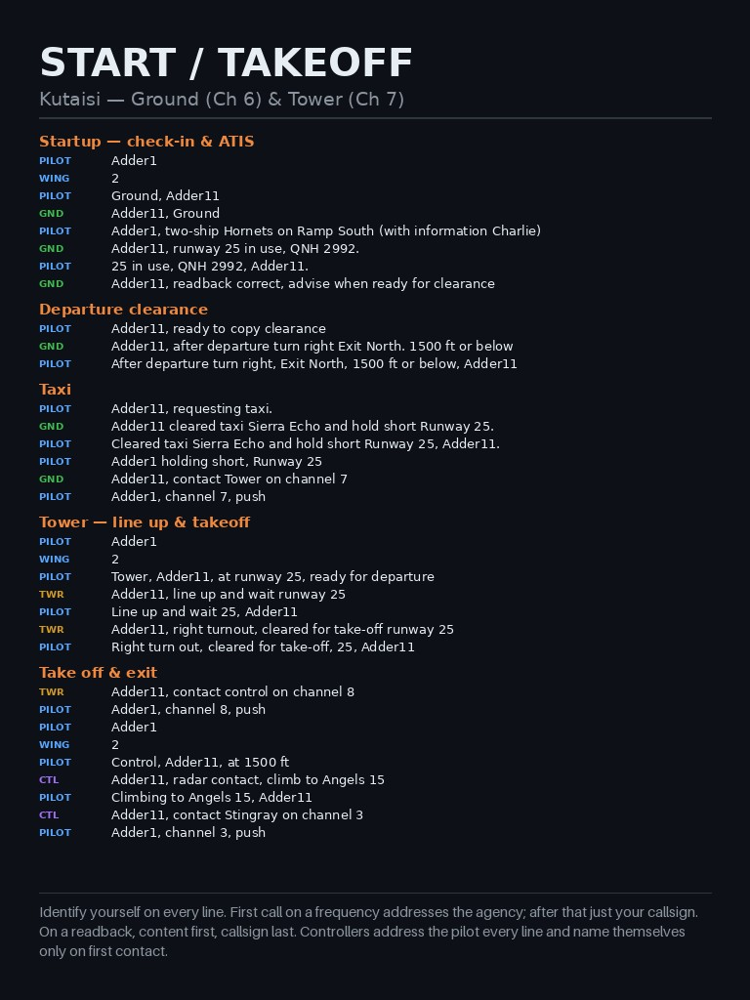
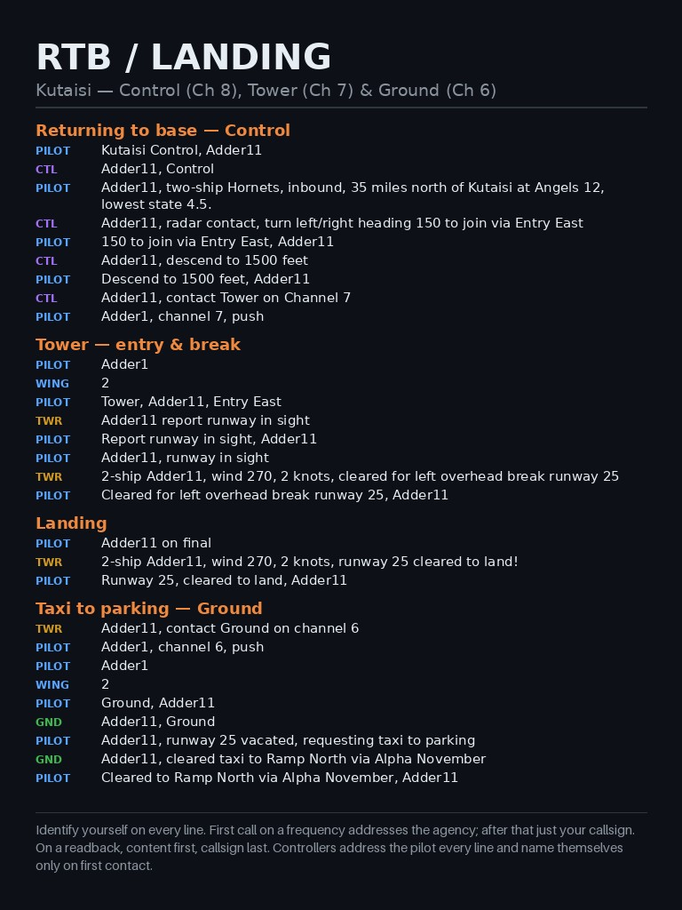
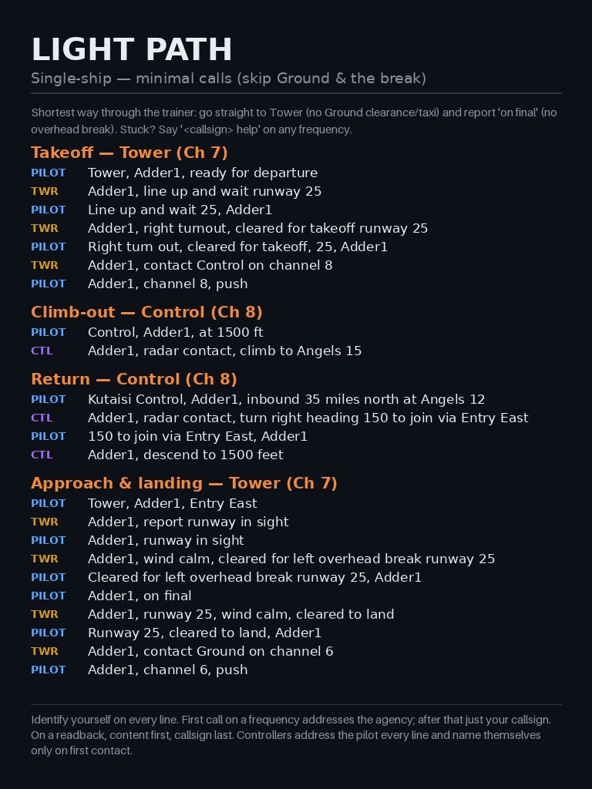

dcs-atc
=======

A **trainer ATC** for DCS World: a bot that acts as Tower, Ground and Control on
real radio (SRS), listens to spoken pilot calls, and answers with correct
phraseology — so you can practise flying the radio like a pro without a human
controller online.

The goal is **training**, not replicating a busy real-world sector. The bot
follows the Master Arms (MA) community SOP and is deliberately a *coach*:

- every clearance is spoken with correct phraseology, so you learn by doing;
- **readbacks are checked** — a complete one is confirmed, an incomplete one is
  flagged ("readback incomplete, I did not get your altitude") but you are
  **never blocked**, so a fumbled call never traps you mid-flight;
- it is forgiving: `say again`, `help`, `reset` and `cancel` always work;
- a **live map** shows the picture, and a saved **debrief** (your trail plus
  every radio call) lets you review a sortie afterwards.

It runs headless beside a DCS dedicated server with **no `.miz` edits and no
mission-scripting changes**: it reads live state through a Saved Games hook and
talks over SRS.

- **Getting it running:** [`INSTALL.md`](INSTALL.md) — Docker, DCS + SRS
  containers, hooks, mission, bot.
- **Behaviour reference:** [`ATC.md`](ATC.md) — callsigns, phraseology, the
  per-pilot state machine, controllers, CTR and runway logic.
- **First test scenario:** [`TESTING.md`](TESTING.md).

What's in the box
-----------------
A DCS dedicated server + SRS server in Docker, and a headless Python ATC bot
(SRS client → Whisper STT → rules-based `brain` → Piper TTS → SRS). No LLM:
the brain is deterministic and testable (offline pytest suite, ~340 tests).

Phraseology cards
-----------------
Glanceable kneeboard cards generated from the **exact** Master Arms SOP dialogs,
so the trainee always has the right call to hand. Page 4 is a **shortened trainer
path**: the fewest calls that get a single-ship airborne and back, using the bot's
actual replies.

  
  
  

- `01-start-takeoff.jpg` — Ground + Tower: check-in, ATIS, clearance, taxi, line-up, takeoff
- `02-rtb-landing.jpg` — Control + Tower + Ground: inbound, join, descent, break, landing
- `03-airborne.jpg` — AWACS / package (check-in, push, attack, RTB handoff)
- `04-light-path.jpg` — **single-ship light path**: skip Ground and the overhead break

Stuck at any point? Say *"<callsign> help"* on any frequency. Regenerate with
`cd scripts && uv run --with pillow kneeboard.py --out ../kneeboard` — see
[`kneeboard/README.md`](kneeboard/README.md).

Layout
------
- `atc/` — the ATC bot:
  - `atc_bot.py` full bot, `listen.py` listen-only, `debug_stt.py` offline STT tuning
  - `brain.py` rules brain + per-pilot state machine, `callsigns.py` mission
    callsign recognition, `phonetics.py` STT-variant generation,
    `speech.py` aviation spoken-number normalisation for TTS
  - `atis.py` weather/ATIS, `srs_client.py` headless SRS client,
    `airspace.py` CTR geometry, `ctr.py` boundary tracker,
    `state_client.py` DCS state reader, `map_server.py` + `web/` live map view
  - `airspace.json` per-airfield config, `phraseology.json` reply wording
  - `tests/` offline pytest suite (`cd atc && uv run pytest`), including
    **system tests** (`test_system.py` + `scenario.py`) that fly full MA dialogs
    through the brain with faked radar/traffic (runway occupied, position
    cross-checks, single/2/4-ship)
- `deploy/dcs/` — docker-compose for the DCS dedicated server and SRS server
- `scripts/dcs.sh` — manage the containers (install/start/stop/logs/srs-*)
- `scripts/state_client.py` — CLI for the DCS state API (JSON socket bridge, port
  10309): `status`, `diag`, `eval`, `move`, `move-geo`, `hold`
- `scripts/kneeboard.py` — generate DCS kneeboard JPGs from the MA SOP dialogs
- `kneeboard/` — generated phraseology cards (see above)
- `bridge/` — Saved Games hooks: `dcs_state_hook.lua` (state API socket +
  mission-env injection), `dcs_state_body.lua` (mission-side state logic, read
  fresh per request), `srs_autoconnect.lua` (SRS announce)
- `ATC.md` — ATC behaviour reference · `TESTING.md` — first live test scenario

Install
-------
Step-by-step setup (Docker, DCS + SRS containers, Saved Games hooks, mission,
bot) is in **[`INSTALL.md`](INSTALL.md)**. Short version:

    sudo ./scripts/install-docker-ubuntu.sh   # once per host
    ./scripts/dcs.sh install                  # DCS + SRS containers
    ./scripts/dcs.sh bridge                   # state-API hook (port 10309)
    cd atc && uv sync && ./start_bot.sh       # join SRS on 263.000 AM

Day-2 operation is also in [`INSTALL.md`](INSTALL.md): `./scripts/dcs.sh
status|logs|stop|start`, `srs-logs`, and `python3 scripts/state_client.py
status`.

State API
---------
Read live DCS mission state (groups, airbases, positions) via the socket hook:

    python3 scripts/state_client.py status

The same `exchange()` helper is what the ATC logic will use to get the picture
(who is where, which runway/base is active) for real ATC decisions.

How it works (no mission edits required)
----------------------------------------
DCS runs several isolated Lua VMs. The Simulator Scripting Engine API
(`coalition`, `Group`, `coord`) only works in the **mission** state, and the
Saved Games hook runs in the **gui** state (whose `coalition` is a stub). The
hook therefore injects the mission-side logic into the mission state at runtime:

    hook (gui) --net.dostring_in('mission')--> a_do_script(body) --> SSE API

`bridge/dcs_state_body.lua` holds that mission-side logic and is read fresh on
every request, so it can be edited and redeployed (`./scripts/dcs.sh bridge`)
without restarting DCS. Only changes to `dcs_state_hook.lua` itself need a DCS
restart. This works on any mission (e.g. Through The Inferno) with no `.miz`
changes and no `MissionScripting.lua` de-sanitize.

Debugging helpers:

    python3 scripts/state_client.py diag          # probe which mechanisms work
    python3 scripts/state_client.py eval '<expr>' # evaluate Lua in the hook env

Airspace / CTR
--------------
Control zones are defined in `atc/airspace.json` (per airfield: tower, frequency,
active runway, CTR polygon or radius, ceiling, runway thresholds, entry/exit
gates). The Kutaisi CTR geometry is derived from the Master Arms community wiki
(https://wiki.masterarms.se/index.php/Airport_Procedures): CTR surface to 1500 ft
AGL, TMA 1500 ft MSL to 10000 ft, CTA above.

`atc/airspace.py` builds the geometry with shapely (lat/lon projected to a local
metric plane) and answers containment/distance/bearing queries. `atc/ctr.py`
tracks per-aircraft inside/outside state and emits `ENTERED_CTR` / `EXITED_CTR`
events. The bot uses these to make inbound replies distance-aware and to warn on
unannounced CTR entry:

- inbound call outside the CTR → "report entering the control zone"
- inbound call inside the CTR → "radar contact <position>, cleared control zone
  entry, join left downwind runway 25"
- unannounced entry → "you are entering controlled airspace without clearance..."

The bot reads live positions from the state bridge (`--state-host/--state-port`,
disable with `--no-state`). It also detects an occupied runway and calls a
go-around for aircraft on final. See `ATC.md` for the full behaviour reference
(callsigns, phraseology, per-pilot state machine, CTR and runway logic).

Configuration is data-driven: `atc/airspace.json` is the single source of truth
for each airfield's tower name, frequency, ATIS frequency, active runway, CTR and
runways. Start the bot with `--airfield <name>` and everything else follows; CLI
flags (`--freq`, `--name`, `--atis-freq`) override if needed. Reply wording lives
in `atc/phraseology.json` (templates with `{placeholders}`), and callsigns are
read from the loaded mission's player slots (`env.mission`), so the bot only
reacts to flights that actually exist.

The bot also broadcasts **ATIS** on its own frequency (Kutaisi 270.500 AM),
built from live DCS weather: active runway from wind, QNH, CAVOK/visibility, and
an hour-based information letter (Alpha, Bravo, …). See `ATC.md` §10.

Map view
--------

The bot can serve a **live map** (Leaflet + OpenStreetMap) showing the CTR,
gates, runways, taxi routes and parking, plus every player aircraft with its
callsign, flight phase and current controller. `start_bot.sh` enables it by
default on port 8090; to run the bot directly, pass `--map-port`:

    ./atc/start_bot.sh                      # map on http://<host>:8090/
    uv run atc_bot.py --airfield Kutaisi --map-port 8090

Then open `http://<host>:8090/`. It can also run standalone (no bot) with
`uv run map_server.py --airfield Kutaisi --port 8090`. No extra Python
dependencies — the server is stdlib `http.server`; Leaflet loads from a CDN.
If the port is already in use the bot logs a warning and keeps running without
the map. The page also has a collapsible **Chatter** drawer (recent radio
traffic, filterable by agency) for live debugging.

### Debriefs / replay

Run the bot with `--debug` (or `./start_bot.sh --debug`) and it saves a
**debrief** each session: every aircraft's flight trail plus every radio call.
The map page has a **debrief** dropdown — pick one to load it and review a
sortie after the fact (green trail, comm clusters, chatter), on any machine that
can reach the map. Playback is visual only: it never re-synthesises TTS.

License
-------

MIT — see [LICENSE](LICENSE). Copyright (c) 2026 Stefan Grufman ("Caveman").
